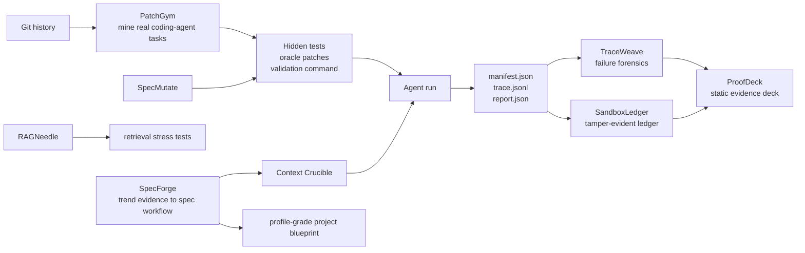

# Nripanka Das

**I build local-first evaluation infrastructure for coding agents.**

Most AI coding demos answer a soft question: *can the agent produce something
that looks plausible?* My work asks the harder engineering question:

> Can an agent solve a real task mined from Git history, under hidden tests,
> with a trace we can inspect and a run ledger we can verify later?

That is the center of this GitHub profile: small, inspectable systems for
agentic AI evaluation, RAG stress testing, reproducibility, context engineering,
spec-driven workflow design, and correctness-focused developer tools.

## Start Here

| If you want to see... | Open this first | What to look for |
|---|---|---|
| A real coding-agent benchmark | [PatchGym](https://github.com/nripankadas07/patchgym) | Git-history task mining, hidden tests, oracle patches, reproducible runs. |
| A visual project demo | [SpecForge live](https://nripankadas07.github.io/specforge/) / [source](https://github.com/nripankadas07/specforge) | Trend evidence, spec workflow graph, guardrails, and blueprint export. |
| Verifiable run evidence | [ProofDeck](https://github.com/nripankadas07/proofdeck) | Static evidence bundles, audit scorecards, attestations, and Merkle roots. |
| Agent trace debugging | [TraceWeave](https://github.com/nripankadas07/traceweave) | Loop detection, causal edges, context drift, and failure-risk reports. |

## The Flagship Stack



| System | Role | Why It Is Worth Reading |
|---|---|---|
| [PatchGym](https://github.com/nripankadas07/patchgym) | Local SWE-bench-style task miner and runner | Mines real Git history into hidden-test coding-agent tasks with auditable oracle patches. |
| [TraceWeave](https://github.com/nripankadas07/traceweave) | Agent trajectory forensics | Reads local traces and finds loops, tool churn, context drift, causal handoffs, and risk signals. |
| [SandboxLedger](https://github.com/nripankadas07/sandboxledger) | Reproducibility ledger | Hashes PatchGym run artifacts into an append-only ledger with previous-hash chaining and a Merkle root. |
| [ProofDeck](https://github.com/nripankadas07/proofdeck) | Static evidence deck | Packages PatchGym, TraceWeave, and SandboxLedger artifacts into a verifiable HTML, JSON, and attestation bundle. |
| [SpecForge](https://github.com/nripankadas07/specforge) | Spec-driven workflow studio | Ranks high-star GitHub/project signals, simulates guarded build workflows, and exports README-ready project blueprints. |
| [Context Crucible](https://github.com/nripankadas07/context-crucible) | Coding-agent context packer | Scores repository files, budgets context, and guards against hidden-test or oracle leakage. |
| [RAGNeedle](https://github.com/nripankadas07/ragneedle) | Adversarial RAG benchmark generator | Creates deterministic needle-in-corpus retrieval tasks with distractor pressure and citation metrics. |
| [SpecMutate](https://github.com/nripankadas07/specmutate) | Metamorphic test generator | Turns behavior specs into deterministic test vectors for parsers, CLIs, normalizers, and small tools. |

## One Run, Four Proof Layers

```bash
git clone https://github.com/nripankadas07/patchgym
cd patchgym
python -m pip install -e ".[dev]"
python -m pip install git+https://github.com/nripankadas07/traceweave
python -m pip install git+https://github.com/nripankadas07/sandboxledger
python -m pip install git+https://github.com/nripankadas07/proofdeck
patchgym demo --keep-dir /tmp/patchgym-proof
traceweave patchgym /tmp/patchgym-proof/runs/oracle --json
sandboxledger ingest-patchgym /tmp/patchgym-proof-ledger.jsonl /tmp/patchgym-proof/runs/oracle
sandboxledger verify /tmp/patchgym-proof-ledger.jsonl
proofdeck build /tmp/patchgym-proof/runs/oracle --ledger /tmp/patchgym-proof-ledger.jsonl --out /tmp/proofdeck-site
proofdeck verify /tmp/proofdeck-site/bundle.json
```

That flow produces:

- a real mined coding-agent task;
- hidden-test validation;
- `manifest.json` with commit ids, patch hashes, artifact hashes, return codes,
  changed files, and totals;
- `trace.jsonl` for forensic analysis;
- a verifiable SandboxLedger record for the run;
- a static ProofDeck site with a canonical bundle, audit scorecard,
  attestation file, and artifact Merkle root.

This is the profile thesis in executable form: **agent evaluation should leave
evidence, not just screenshots.**

## Deep Inspection Path

| Time | Read / Run |
|---|---|
| 2 minutes | [PatchGym README](https://github.com/nripankadas07/patchgym) and `bash scripts/demo.sh` |
| 3 minutes | [SpecForge live demo](https://nripankadas07.github.io/specforge/) and [source](https://github.com/nripankadas07/specforge) |
| 5 minutes | [PatchGym reproducible runs](https://github.com/nripankadas07/patchgym/blob/main/docs/reproducible-runs.md) |
| 7 minutes | [TraceWeave PatchGym traces](https://github.com/nripankadas07/traceweave/blob/main/docs/patchgym-traces.md) |
| 10 minutes | [SandboxLedger PatchGym ingestion](https://github.com/nripankadas07/sandboxledger/blob/main/docs/patchgym-ingest.md) |
| 12 minutes | [ProofDeck](https://github.com/nripankadas07/proofdeck) and `proofdeck demo --out /tmp/proofdeck-demo` |
| 15 minutes | [Visible Agent Evaluation](essays/visible-agent-evaluation.md) |

## Why This Portfolio Exists

I use AI heavily, but I do not want AI-assisted software to be judged by vibes.
The systems here are built around harder boundaries:

- hidden tests instead of self-reported success;
- traces instead of opaque agent transcripts;
- manifests instead of loose claims;
- hash ledgers instead of mutable screenshots;
- local-first demos instead of hosted black boxes;
- small parsers and utilities with adversarial tests instead of broad,
  untestable abstractions.

The result is a portfolio with one technical identity:

> local-first infrastructure for evaluating, debugging, and hardening coding
> agents.

## Supporting Systems

These repositories support the flagship stack without competing with it.

| Area | Projects |
|---|---|
| Agent and eval infrastructure | [agent-framework](https://github.com/nripankadas07/agent-framework), [rag-pipeline](https://github.com/nripankadas07/rag-pipeline), [prompt-eval](https://github.com/nripankadas07/prompt-eval), [token-counter](https://github.com/nripankadas07/token-counter), [ai-toolkit](https://github.com/nripankadas07/ai-toolkit) |
| Correctness substrate | [safejson](https://github.com/nripankadas07/safejson), [tomlmini](https://github.com/nripankadas07/tomlmini), [bencode](https://github.com/nripankadas07/bencode), [csvinfer](https://github.com/nripankadas07/csvinfer), [urlnorm](https://github.com/nripankadas07/urlnorm), [jsonptr](https://github.com/nripankadas07/jsonptr), [jsonpatch-lite](https://github.com/nripankadas07/jsonpatch-lite) |
| TypeScript systems primitives | [decimal-ts](https://github.com/nripankadas07/decimal-ts), [lru-ts](https://github.com/nripankadas07/lru-ts), [task-queue](https://github.com/nripankadas07/task-queue), [tokenring-ts](https://github.com/nripankadas07/tokenring-ts), [eventbus-ts](https://github.com/nripankadas07/eventbus-ts), [decoder-ts](https://github.com/nripankadas07/decoder-ts) |
| Local-first product labs | [SpecForge](https://github.com/nripankadas07/specforge), [lanbeam](https://github.com/nripankadas07/lanbeam), [rssdeck](https://github.com/nripankadas07/rssdeck), [passhouse](https://github.com/nripankadas07/passhouse), [syncplan](https://github.com/nripankadas07/syncplan), [readmine](https://github.com/nripankadas07/readmine), [photoflow](https://github.com/nripankadas07/photoflow), [dnswarden](https://github.com/nripankadas07/dnswarden), [medialoom](https://github.com/nripankadas07/medialoom), [chatmux](https://github.com/nripankadas07/chatmux), [uptimelog](https://github.com/nripankadas07/uptimelog) |

Every active repository is expected to have tests, CI, license metadata, issue
templates, a pull request template, security notes, contribution notes, and a
clear docs or examples surface.

## Community Surface

The flagship repositories have Discussions enabled for design questions,
evaluation ideas, benchmark comparisons, and integration notes:

- [PatchGym discussions](https://github.com/nripankadas07/patchgym/discussions)
- [ProofDeck discussions](https://github.com/nripankadas07/proofdeck/discussions)
- [SpecForge discussions](https://github.com/nripankadas07/specforge/discussions)
- [TraceWeave discussions](https://github.com/nripankadas07/traceweave/discussions)

Issues are kept for reproducible bugs, docs gaps, and scoped feature requests.

## Public Audit

Last audited on **June 13, 2026** across the live public GitHub profile.

| Signal | Current State |
|---|---|
| Public repositories | 118 total: 117 active, 1 archived scratchpad |
| Active repo hygiene | 117/117 have README, license metadata, license file, CI, issue templates, and PR templates |
| Latest completed CI | 117/117 active repos passing or queued at audit time |
| Docs/examples surface | 117/117 active repos |
| Research launch | 5 new local-first agent/eval projects shipped on May 28, 2026 |
| Evidence launch | ProofDeck shipped on June 6, 2026 as the static review layer for the flagship stack |
| Spec workflow launch | SpecForge shipped on June 13, 2026 as the profile-grade project selection and workflow studio |
| Flagship integration | PatchGym emits run manifests and traces; TraceWeave analyzes them; SandboxLedger records them; ProofDeck packages them |
| Open issue load | 0 open issues across active repositories at audit time |

Audit notes:

- [Portfolio audit](docs/PORTFOLIO_AUDIT.md)
- [Deep audit, June 13 2026](docs/DEEP_AUDIT_2026-06-13.md)
- [Deep audit, June 6 2026](docs/DEEP_AUDIT_2026-06-06.md)
- [Deep audit, May 28 2026](docs/DEEP_AUDIT_2026-05-28.md)

## How I Work

I use AI for scaffolding, test generation, edge-case brainstorming, and
first-pass documentation. The architecture, project boundaries, quality bar,
final review, and public positioning are mine.

AI-assisted output has to survive source-checkout setup, local tests, CI,
security notes, limitation notes, and manual review before it becomes part of
the public portfolio. That is why the profile emphasizes reproducible demos and
auditable artifacts instead of fake adoption badges or inflated benchmark
claims.

## Essays

- [PatchGym: Local Coding-Agent Benchmarks From Real Git History](essays/patchgym-local-benchmarks.md)
- [Visible Agent Evaluation: Testing The Loop, Not The Demo](essays/visible-agent-evaluation.md)
- [Safe Local-First AI Tooling: Small Systems With Hard Boundaries](essays/local-first-ai-safety.md)

## Professional Context

This GitHub profile is intentionally code-first. Career credentials, product
leadership context, and publication context live on
[LinkedIn](https://www.linkedin.com/in/nripankadas/).

For bugs, design questions, or focused collaboration, open an issue on the
relevant repository. For profile-level context, use
[nripankadas07/nripankadas07](https://github.com/nripankadas07/nripankadas07).
