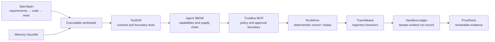
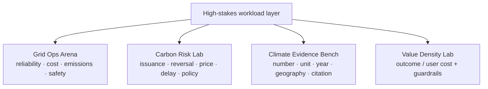

# Nripanka Das

**I build reliable AI for high-stakes decisions.**

My open-source work joins two worlds that are usually kept apart:

- agent infrastructure with explicit policy, tests, replay, provenance, and human control;
- executable decision systems for energy, climate, carbon risk, and product outcomes.

I am an AI product leader working across energy and supply chain. This is my
independent, code-first lab: no employer data, branding, or implied endorsement.
Professional context and writing live on [LinkedIn](https://www.linkedin.com/in/nripankadas/).

## Start here

| Project | The hard question it answers | Proof path |
|---|---|---|
| [PatchGym](https://github.com/nripankadas07/patchgym) | Can a coding agent fix a real task mined from Git history under hidden tests? | Mine the demo repository, run the agent, inspect the oracle split and manifest. |
| [Trustline MCP](https://github.com/nripankadas07/trustline-mcp) | Should this tool call be allowed, denied, or held for human approval? | Run the attack fixture, inspect matched rules, then verify the chained audit log. |
| [Grid Ops Arena](https://github.com/nripankadas07/grid-ops-arena) | Can an agent recover a microgrid without violating safety, cost, or emissions constraints? | Replay the seeded outage and compare unsafe, naive, and safe policies. |
| [Value Density Lab](https://github.com/nripankadas07/value-density-lab) | Did a product deliver more user value—or merely capture more user time? | Compare two synthetic product flows and inspect outcomes, costs, regret, and guardrails. |
| [SpecForge](https://nripankadas07.github.io/specforge/) | Can research evidence become an inspectable spec-driven build workflow? | Open the live studio and export a project blueprint. |
| [ProofDeck](https://github.com/nripankadas07/proofdeck) | Can an agent run leave a static evidence bundle that another person can verify? | Build the local deck and verify its artifact Merkle root. |

## The reliability loop



The workloads are not toy chatbots. They are deterministic systems with
explicit scoring and failure behavior:



## Ten complementary proof systems

Released as one coherent reliability program—not ten generic wrappers.

| Repository | What is implemented | Deterministic evidence |
|---|---|---|
| [trustline-mcp](https://github.com/nripankadas07/trustline-mcp) | Deny-overrides MCP policy engine, argument/path/host/quota rules, approval decisions, redaction | JSON decisions, policy coverage, hash-chained audit log, attack report |
| [agent-sbom](https://github.com/nripankadas07/agent-sbom) | Capability-aware scanner for skills, MCP manifests, prompts, scripts, and packages | Component graph, SBOM, risk diff, SARIF, HTML report |
| [runmirror](https://github.com/nripankadas07/runmirror) | Provider-neutral recorder for model, tool, file, approval, clock, random, and error events | Canonical cassette, offline replay, first-divergence report, static timeline |
| [tooldrill](https://github.com/nripankadas07/tooldrill) | JSON-Schema boundary and invalid-input testing for MCP tool contracts | Seeded plan, observations, minimized failures, JUnit, SARIF, HTML |
| [memory-gauntlet](https://github.com/nripankadas07/memory-gauntlet) | Memory scenarios for correction, forgetting, deletion, role isolation, and privacy | Governed vs leaky adapters, checkpoint ledger, leakage and stale-fact scorecard |
| [specspan](https://github.com/nripankadas07/specspan) | Markdown requirement-to-code-to-test traceability and drift checks | Trace graph, orphan/broken-link findings, impact report, SARIF |
| [grid-ops-arena](https://github.com/nripankadas07/grid-ops-arena) | Seeded microgrid dispatch with load, renewables, storage, peaker, and outage events | Trajectory, violations, reliability/cost/emissions/safety score, replay |
| [carbon-risk-lab](https://github.com/nripankadas07/carbon-risk-lab) | Monte Carlo portfolio engine for issuance, reversal, price, delay, counterparty, and policy risk | Percentiles, VaR/CVaR, stresses, sensitivity, reproducible samples |
| [climate-evidence-bench](https://github.com/nripankadas07/climate-evidence-bench) | Answer evaluator for numeric, unit, year, geography, provenance, citation, and temporal validity | JSONL tasks/submissions, failure taxonomy, component scorecard, report |
| [value-density-lab](https://github.com/nripankadas07/value-density-lab) | Executable implementation of my published Value Density framework | Versioned event ledger, four calculators, variant comparison, guardrail dashboard |

Each repository has an offline, no-key demo; a versioned machine-readable
artifact; tests and CI; security/assumption notes; limitations; and a static
human-readable report. The applied demos are synthetic and make no claim about
real grid operations, carbon portfolios, or climate facts.

## Existing evaluation stack

[PatchGym](https://github.com/nripankadas07/patchgym) remains the coding-agent
benchmark front door. A run can flow through:

```text
Git history → hidden-test task → agent patch → manifest + trace
           → TraceWeave analysis → SandboxLedger record → ProofDeck bundle
```

Supporting projects:

- [TraceWeave](https://github.com/nripankadas07/traceweave): loop, churn, drift, causal-edge, and risk analysis for agent traces.
- [SandboxLedger](https://github.com/nripankadas07/sandboxledger): content-addressed, previous-hash-chained run ledger.
- [ProofDeck](https://github.com/nripankadas07/proofdeck): static HTML/JSON/attestation evidence bundles.
- [RAGNeedle](https://github.com/nripankadas07/ragneedle): deterministic retrieval stress tasks.
- [Context Crucible](https://github.com/nripankadas07/context-crucible): budgeted repository context with leakage guards.

## Working principles

- **Human takeover is a design requirement.** High-stakes automation needs a clear switch, scoped authority, and visible approval state.
- **Evaluation must leave evidence.** A screenshot or confident transcript is not a test result.
- **Local-first is a trust boundary.** Demos work without an account, API key, or silent telemetry.
- **Composite scores must expose their parts.** Cost, safety, regret, provenance, and uncertainty remain inspectable.
- **Benchmarks need limitations.** Synthetic fixtures and small samples are labeled; no generated number is presented as real-world adoption.
- **AI assistance is disclosed.** AI helps with scaffolding, tests, edge cases, and documentation; architecture and public claims remain human-owned.

## Research and audit trail

- [Post-release stress and security audit — August 16, 2026](docs/POST_RELEASE_STRESS_AUDIT_2026-08-16.md)
- [Deep profile and landscape audit — August 16, 2026](docs/DEEP_AUDIT_2026-08-16.md)
- [Reliable AI release architecture](docs/RELIABLE_AI_RELEASE.md)
- [Launch and adoption playbook](docs/LAUNCH_PLAYBOOK_2026-08.md)
- [Visible Agent Evaluation](essays/visible-agent-evaluation.md)
- [Safe Local-First AI Tooling](essays/local-first-ai-safety.md)

For reproducible bugs or a scoped collaboration, open an issue in the relevant
repository. For product, energy, climate, or leadership context, use
[LinkedIn](https://www.linkedin.com/in/nripankadas/).
